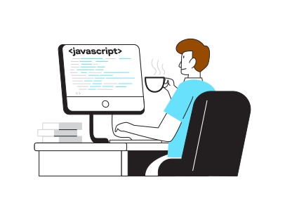

# Thanks for stopping by! 👋

---
  

  

##### ❗ Currently seeking opportunities for remote fullstack/front end roles ❗

My name is **Ethan Soo Hon** a software engineer with a Bachelor's in Computer Science 🎓. I work across the whole web stack with a focus primarily on the front end 💻. I love learning new tools/technologies and imparting my knowledge unto others 📚. For the past year and a half I have been working as a tutor guiding both college students and bootcamp students through their web development classes/cirriculum on the MERN/PERN stack👨‍🏫.

  
  

## Tech Stack
  
  
  
  
  
  
  
  
  
  
  
  
  
  
  
  
  
  
  

## About

- 📝 When I'm not teaching I like to write technical blog posts/tutorials on [Dev.to](https://dev.to/ethanny2)
- 🆕 Currently working with webpack 5, Firebase, Express, Redux-toolkit and React (anything JavaScript!)
- 🔰 Currently improving my skills with Next.js and Gatsby
- 📫 Feel free to reach out on [Twitter](https://twitter.com/ArrayLikeObj) or through my email
- 🎮 Currently playing: [Persona 5 Royal](https://atlus.com/p5r/)
- 🗾 Fun-fact: I studied abroad in Osaka, Japan for 2 years and where I achieved an [JLPT N3 Level](https://www.jlpt.jp/e/about/levelsummary.html) proficiency (mostly) by regularly playing Ultra Street Fighter IV at the arcade with locals

  

  俺より強い奴に会いに行く！ - リュウ

----

 You're the 
 
 vistor!

